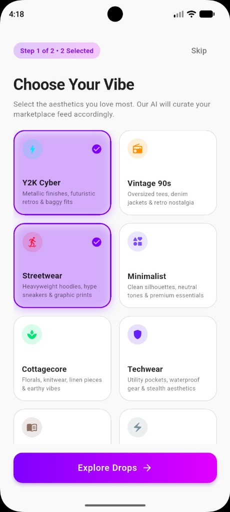
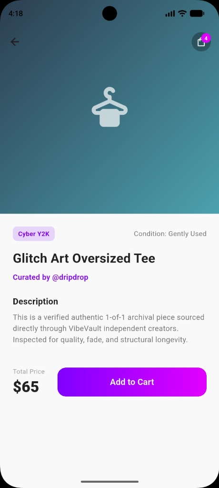
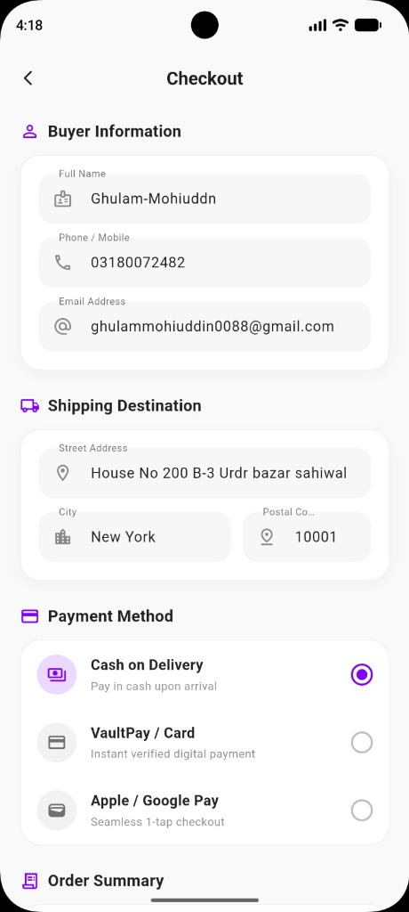
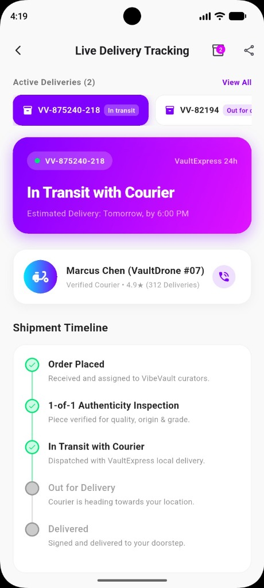

<div align="center">

# ⚡ VibeVault

### *Next-Gen Curated Cyberpunk & Vintage Fashion Marketplace*

[](https://flutter.dev)
[](https://dart.dev)
[](https://supabase.com)
[](https://flutter.dev)
[](LICENSE)

<br/>

**VibeVault** is a cutting-edge mobile commerce application built with **Flutter** and powered by **Supabase**. It redefines fashion commerce for aesthetic subcultures — bridging Y2K, Cyberpunk, Streetwear, Vintage 90s, and Techwear archives with 1-of-1 verified authenticity, real-time live drops, and interactive delivery tracking.

[Explore Features](#-key-features) • [Screenshots](#-visual-showcase) • [Architecture](#-project-architecture) • [Getting Started](#-getting-started) • [Database Schema](#-database-schema)

---

</div>

<br/>

## 📱 Visual Showcase

<div align="center">

| 01. Vibe Onboarding | 02. Product Details |
|:---:|:---:|
|  |  |
| **Aesthetic Personalization**<br>Interactive multi-vibe selection for AI-curated drops | **1-of-1 Archival Piece**<br>Condition ratings, curator credentials & instant bag add |

<br/>

| 03. Frictionless Checkout | 04. Live Delivery Tracking |
|:---:|:---:|
|  |  |
| **Streamlined Checkout**<br>Auto-filled profile, verified shipping & multiple payment methods | **VaultExpress 24h Tracking**<br>5-step authenticity timeline, courier contact & multi-shipment switcher |

</div>

<br/>

---

## 🌟 Key Features

### 🎨 1. AI-Driven Aesthetic Personalization
- **Vibe Curation Engine**: Select your favorite subcultures (*Y2K Cyber*, *Vintage 90s*, *Streetwear*, *Minimalist*, *Cottagecore*, *Techwear*, *Dark Academia*, *Grunge*).
- **Preference Persistence**: User aesthetics sync directly to Supabase `user_preferences` for tailored drop recommendations.

### ⚡ 2. Real-Time Live Drop Feed
- **Live Inventory Sync**: Powered by Supabase Realtime WebSocket streams — new drops and stock status update dynamically with zero reload.
- **Dynamic Category Filtering**: Seamlessly filter items by aesthetic category chips with smooth staggered fade/slide micro-animations.
- **Fuzzy Search**: Instant real-time search across drop titles, curated seller tags (`@dripdrop`), and categories.

### 🧥 3. 1-of-1 Archival Verification & Details
- **Archival Provenance**: Detailed pieces verified for authenticity, fade grade, and structural longevity.
- **Curator Spotlights**: View independent curator credentials and ratings.
- **One-Tap Quick Add**: Instant add-to-bag with animated interactive snackbar alerts and reactive cart counters.

### 💳 4. Streamlined & Secure Checkout
- **Smart Autofill**: Seamlessly pulls saved buyer details and address from user profiles.
- **Versatile Payment Support**:
  - 💵 **Cash on Delivery**
  - 💳 **VaultPay / Credit Card**
  - 📱 **Apple / Google Pay** (1-tap express checkout)
- **Zero-Friction Submission**: Complete form validation with responsive loading indicators.

### 🚚 5. Live Delivery Tracking & Multi-Shipment Hub
- **Multi-Order Switcher**: Horizontal switcher bar to track multiple active orders concurrently.
- **Verified Courier Card**: Assigned courier info (*Marcus Chen VaultDrone #07*, *Elena Rostova*, etc.) with direct one-tap calling.
- **5-Stage Authenticity Timeline**:
  1. 📝 *Order Placed*
  2. 🔍 *1-of-1 Authenticity Inspection*
  3. 🚀 *In Transit with Courier*
  4. 🛵 *Out for Delivery*
  5. 📦 *Delivered*
- **Shareable Tracking**: One-tap copy tracking ID to system clipboard.

---

## 🛠️ Tech Stack & Engineering

| Layer | Technology | Description |
|:---|:---|:---|
| **Framework** | [Flutter 3.x](https://flutter.dev) | Cross-platform mobile development (Android & iOS) |
| **Language** | [Dart 3.x](https://dart.dev) | Type-safe, high-performance client language |
| **Backend & Auth** | [Supabase](https://supabase.com) | PostgreSQL, Realtime WebSocket engine, and secure Auth |
| **Local Storage** | [shared_preferences](https://pub.dev/packages/shared_preferences) | Offline-first order and session persistence |
| **Design System** | Material 3 + Custom Cyberpunk | Electric Violet (`#7F00FF`), Neon Magenta (`#E100FF`), Glassmorphism |
| **State Management** | ChangeNotifier & Reactive Listeners | Modular singleton services (`CartService`, `OrderService`) |

---

## 📂 Project Architecture

```plaintext
ecom_app/
├── lib/
│   ├── auth/
│   │   └── auth_screen.dart              # Supabase Auth (Sign Up, Sign In, Profile Sync)
│   ├── checkout/
│   │   ├── checkout_screen.dart          # Form validation, autofill, payment selection
│   │   └── delivery_tracking_screen.dart  # 5-step stepper, multi-order switcher, courier card
│   ├── feed/
│   │   ├── cart_screen.dart              # Bag management, quantities, cost calculation
│   │   ├── product_details_screen.dart   # 1-of-1 inspection details & curator view
│   │   ├── vibe_drawer.dart              # Custom aesthetic navigation drawer
│   │   └── vibe_feed_screen.dart         # Realtime Supabase feed with category filter chips
│   ├── onboarding/
│   │   ├── onboarding_screen.dart        # Vibe picker grid (Y2K, Streetwear, Techwear, etc.)
│   │   └── splash_scree.dart             # Animated brand splash screen
│   ├── services/
│   │   ├── cart_service.dart             # Reactive cart state & badge count notifier
│   │   └── order_service.dart            # Multi-order management & database sync
│   └── main.dart                         # Entry point, Supabase initialization & theme config
├── screenshots/
│   ├── 01_choose_vibe.jpg                # Vibe selection screen capture
│   ├── 02_product_details.jpg            # Product detail view screen capture
│   ├── 03_checkout.jpg                   # Checkout screen capture
│   └── 04_live_tracking.jpg              # Live delivery tracking screen capture
├── pubspec.yaml                          # Dependencies and assets
└── README.md                             # Project documentation
```

---

## 🗄️ Database Schema

VibeVault utilizes Supabase (PostgreSQL) with the following relational models:

```sql
-- 1. Profiles Table
create table public.profiles (
  id uuid references auth.users not null primary key,
  full_name text,
  email text,
  mobile text,
  address text,
  created_at timestamp with time zone default timezone('utc'::text, now())
);

-- 2. User Preferences (Aesthetic Vibes)
create table public.user_preferences (
  user_id uuid references auth.users not null primary key,
  preferred_vibes jsonb default '[]'::jsonb,
  updated_at timestamp with time zone default timezone('utc'::text, now())
);

-- 3. Products (Archival Drops)
create table public.products (
  id uuid default gen_random_uuid() primary key,
  title text not null,
  description text,
  price numeric not null,
  category text not null,
  condition text default 'Mint',
  seller text not null,
  gradient_colors jsonb default '["#2E0854", "#5B0E2D"]'::jsonb,
  icon_name text default 'dry_cleaning_rounded',
  created_at timestamp with time zone default timezone('utc'::text, now())
);

-- 4. Orders & Tracking
create table public.orders (
  id uuid default gen_random_uuid() primary key,
  order_id text unique not null,
  user_id uuid references auth.users,
  total numeric not null,
  shipping_fee numeric default 0,
  buyer_name text,
  buyer_phone text,
  buyer_email text,
  buyer_address text,
  buyer_city text,
  postal_code text,
  payment_method text,
  status text default 'shipped',
  courier_name text,
  courier_phone text,
  estimated_delivery text,
  items jsonb default '[]'::jsonb,
  created_at timestamp with time zone default timezone('utc'::text, now())
);
```

---

## 🚀 Getting Started

### Prerequisites

Ensure you have installed:
- [Flutter SDK](https://docs.flutter.dev/get-started/install) (`^3.13.4` or higher)
- [Dart SDK](https://dart.dev/get-started)
- [Android Studio](https://developer.android.com/studio) / [Xcode](https://developer.apple.com/xcode/) / VS Code with Flutter extensions
- A [Supabase](https://supabase.com/) account and project

### Installation

1. **Clone the Repository**
   ```bash
   git clone https://github.com/Ghulam-Mohiuddin007/ecom_app.git
   cd ecom_app
   ```

2. **Install Dependencies**
   ```bash
   flutter pub get
   ```

3. **Configure Supabase Credentials**
   In `lib/main.dart`, provide your Supabase URL and Anon/Publishable Key:
   ```dart
   await Supabase.initialize(
     url: 'YOUR_SUPABASE_PROJECT_URL',
     publishableKey: 'YOUR_SUPABASE_PUBLISHABLE_KEY',
   );
   ```

4. **Run the Application**
   ```bash
   # Run on connected mobile device or emulator
   flutter run

   # Or run on Chrome for Web preview
   flutter run -d chrome
   ```

---

## 🎨 Design Philosophy

- **Electric Color Palette**: High-contrast violet (`#7F00FF`) to hot magenta (`#E100FF`) gradients paired with dark obsidian surfaces (`#121212`) and sleek light mode (`#F9F9F9`).
- **Tactile Feedback**: Subtle drop shadows, pill badges, and bouncy physics for an engaging mobile-native experience.
- **Glassmorphic Cards**: Depth-enhanced containers with subtle border highlights for a futuristic aesthetic.

---

## 👤 Author

**Ghulam Mohiuddin**
- GitHub: [@Ghulam-Mohiuddin007](https://github.com/Ghulam-Mohiuddin007)
- Repository: [Ghulam-Mohiuddin007/ecom_app](https://github.com/Ghulam-Mohiuddin007/ecom_app)

---

## 📄 License

This project is licensed under the [MIT License](LICENSE).
